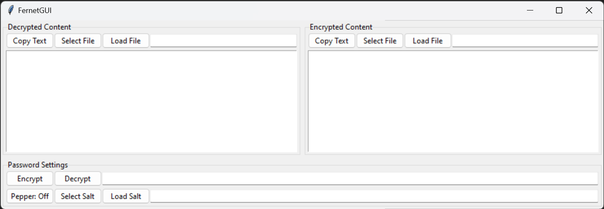

# Fernet GUI

GUI for encrypting and decrypting text using [Fernet](https://cryptography.io/en/42.0.7/fernet/).

# Todo

- [ ] On click event for copy buttons.
- [ ] Load files from the disk.
    - [ ] Load file by path.
    - [ ] Create file open dialog.
    - [ ] Don't display binary content.
- [ ] Support for [salt](https://en.wikipedia.org/wiki/Salt_(cryptography)).
    - [ ] Generate salt.
    - [ ] Load salt by path.
    - [ ] Auto-load at startup.
- [ ] Encrypt and decrypt buttons.
    - [ ] Display encrypted / decrypted content.
    - [ ] Autosave content to file.
    - [ ] **Future plan:** Dedicated save button. (Only for text files).
- [ ] **Future plan:** Support for [pepper](https://en.wikipedia.org/wiki/Pepper_(cryptography)).